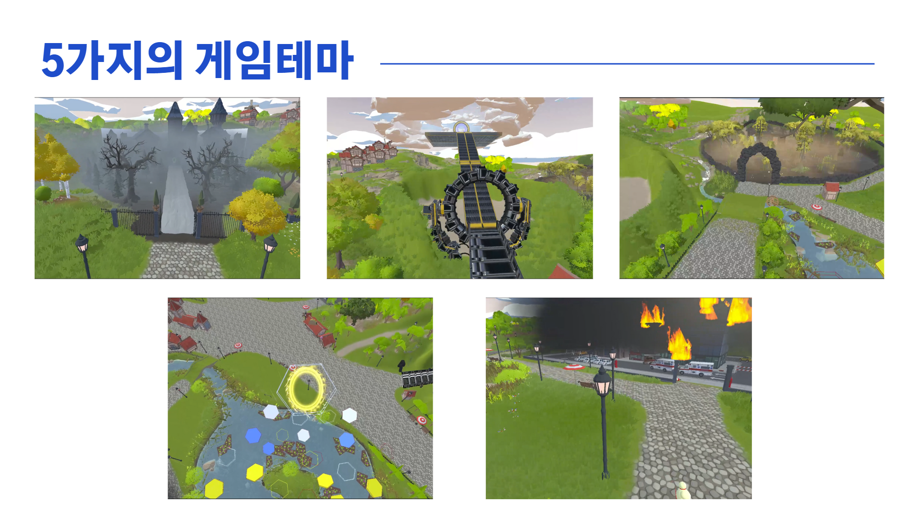
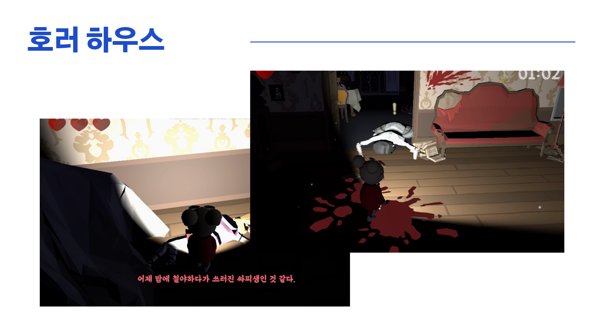
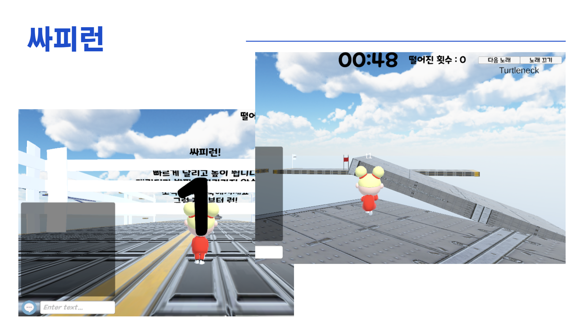
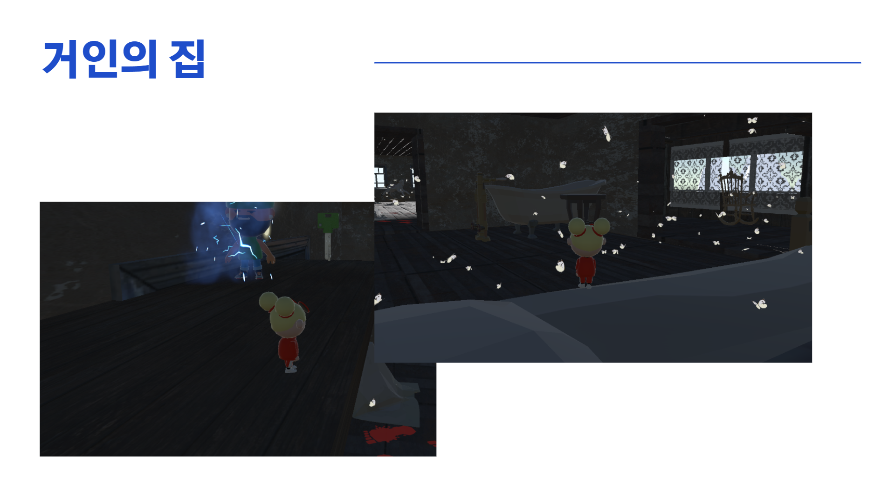
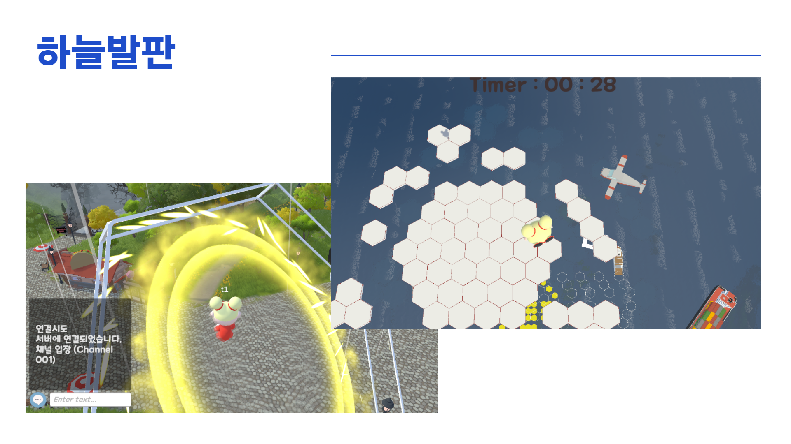
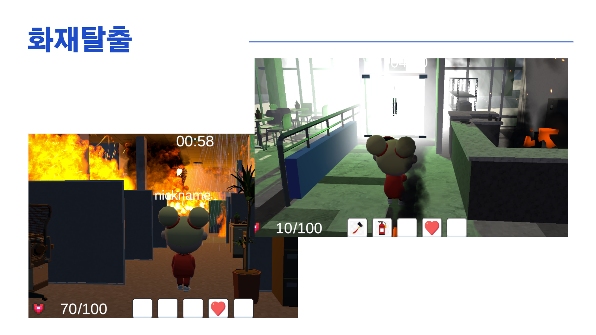
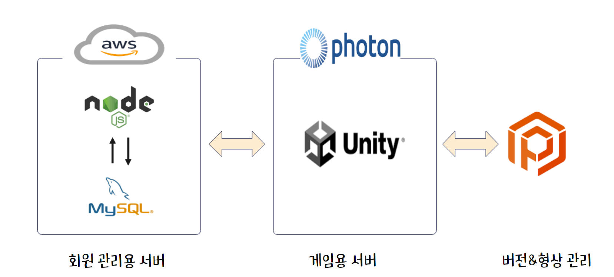
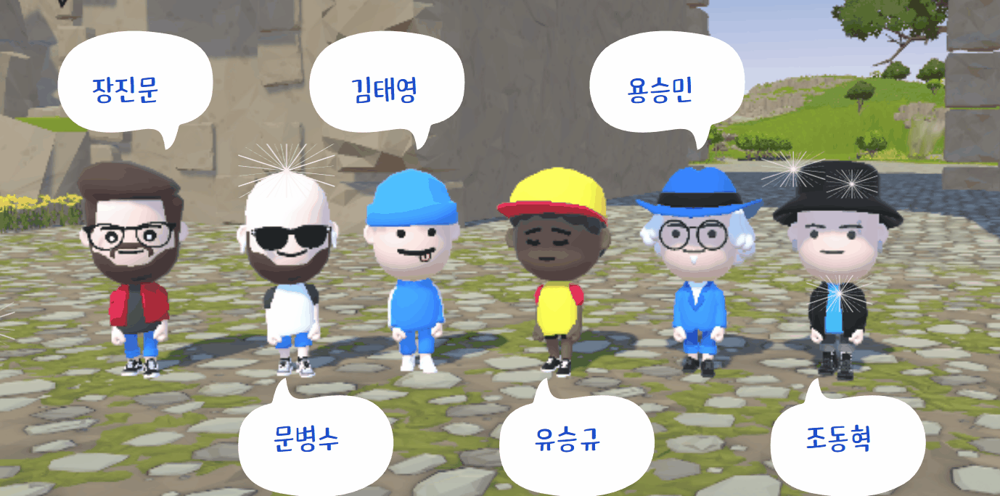

# 서비스 : 메타버스에서 만남을 추구하면 안되는 걸까

## Overview

메타버스 세상을 통해 사람들이 만나면서 소통을 하고 어떻게 하면 즐겁게 게임을 할 수 있을까라는 고민속에서 다양한 게임을 여러사람들과 즐기면서 경기결과를 기록하자라는 취지에서 테마파크형 멀티플레잉 게임을 기획하게 되었다.

## 👀 플레이 화면

---

25가지의 개성있는 캐릭터!!
---

만남을 통해 소통과 힐링이 가능한 공간!!
---

5가지의 다양하고 개성있는 테마!!
---

다양한 사물들과 상호작용하여 힌트를 얻고 좀비AI 피해서 탈출하는 공포게임!! 
---

여러 장애물들을 돌파하여 빠르시간안에 클리어기록 겨루는 레이스게임!!
---

숨겨진 퀘스트들을 진행해 퀴즈를 풀어 거인의집을 탈출하는 추리게임!!
---

버프와 디버프가 걸려있는 발판에서 최대한 오래 살아남는 미니게임!!
---

화마를 피해 달아나 미션을 수행하여 재난에서 탈출하는 생존게임!!
---
## 🙃 프로젝트 기간

2023.02.27 ~ 2023.04.07

## 개발 환경 🎆

###### 📕 형상 관리

Plastic SCM

###### 📖 이슈 관리

Jira

###### 📗 커뮤니케이션

Mattermost, Notion, RealLife

###### 📘 OS

Windows10

###### 📓 Engine

Unity 2021.3.9f1

###### 📒 Server

Photon, AWS EC2, Ubuntu 20.04, node.js 10.19.0

###### 📜 DataBase

MySQL 8.0.30

## 서비스 아키텍쳐

## Hellow NEW World 팀원소개 🙍‍♀️🙍‍♂️

**✨유승규**, 조동혁, 문병수, 김태영, 장진문, 용승민

### 팀원 역할

- (팀장)유승규
  - Unity
    - 싸피런 테마 전체 총괄 및 스크립트 작성
      - 세이브포인트 구현
      - 배경음악 재생 및 컨트롤
  - Photon Chat
    - 유니티내에서 photon Chat 서버를 활용하여 채팅 기능 구현
  - Cinemachine
    - 시네머신 카메라를 통해 유니티 영상제작
- 조동혁
  - Unity
    - 회원가입 UI 작성
    - 퀘스트, 퀴즈 스크립트 작성
    - Object 건물 배치 및 트리거 생성
    - NPC 생성 및 퀘스트 스토리 작성
    - 거인의 집 테마 전체 총괄 및 스크립트 작성
- 문병수
  - Unity
    - 회원가입 로직 작성 구현
  - Backend
    - 회원관리를 위한 백엔드 구현`
    - 랭킹관리를 위한 백엔드 구현
  - Photon
    - 서버연결 구성
- 김태영
  - Unity
- 장진문
  - Unity
    - 미니 게임 (하늘 발판)
      - 발판 오브젝트 구현
      - Stage 1 ~ Stage 6 오브젝트 배치
      - 발판 별 버프, 디버프 스크립트 제작
      - 하늘발판 전용 UI 제작
      - 타이머 UI 제작
      - BGM 삽입
    - 랭킹보드 제작
      - 랭킹보드 오브젝트 제작
      - 랭킹보드 스크립트 제작
- 용승민
  - Unity
    - 캐릭터 구현
      - 캐릭터 이동 및 카메라 구현
      - 3인칭 플레이
      - 각 테마별 캐릭터 생성구현
    - 화재탈출
      - 화재탈출 퀘스트 및 트리거 구현
  - Photon
    - 포톤을 통한 멀티 구현
